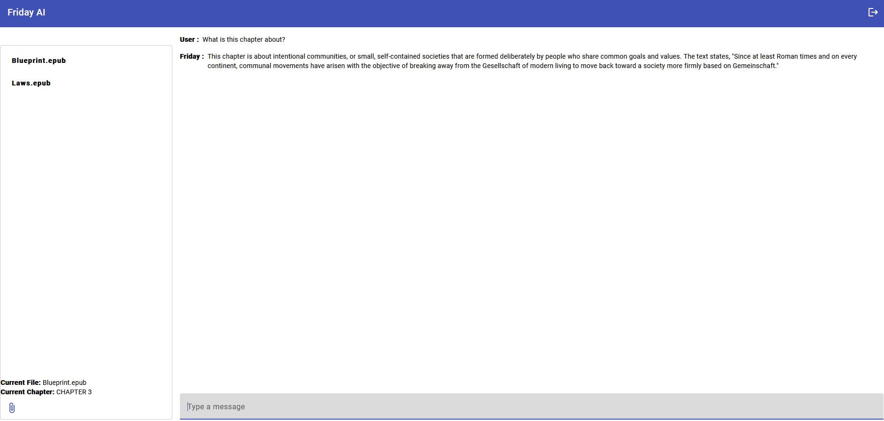

## What is Friday?

Friday is your personal librarian. 
Upload your .epub file, select the chapter that you want to analyze, ask Friday any questions in regards to the selected chapter and Friday will provide you with the answers. Friday is a chatbot that uses Natural Language Processing (NLP) to analyze the text in the selected chapter and provide you with the answers to your questions. 

## Who is Friday for?

Friday is a great tool for students, researchers, and book lovers who want to quickly analyze the text in a chapter and get answers to their questions. 

